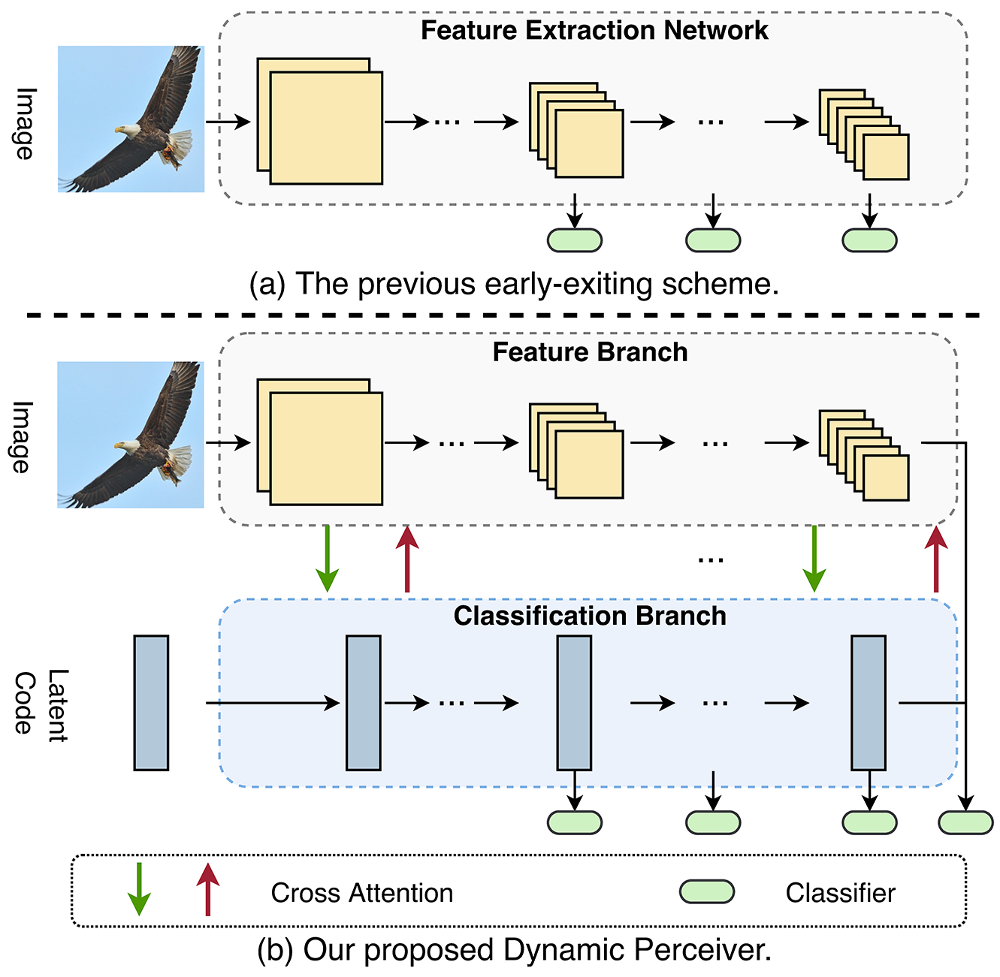
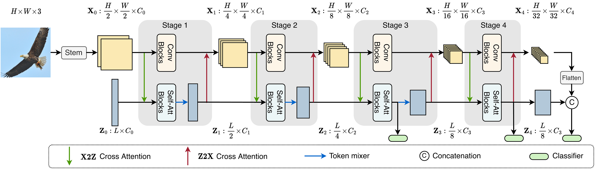
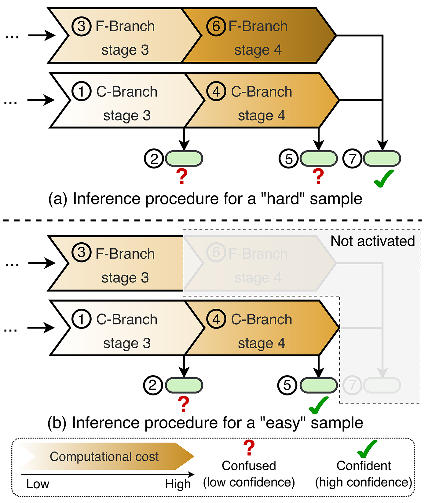
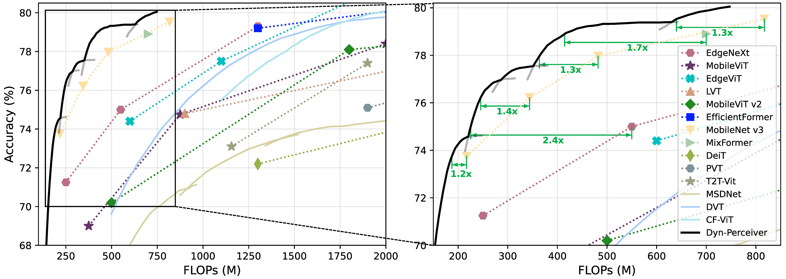
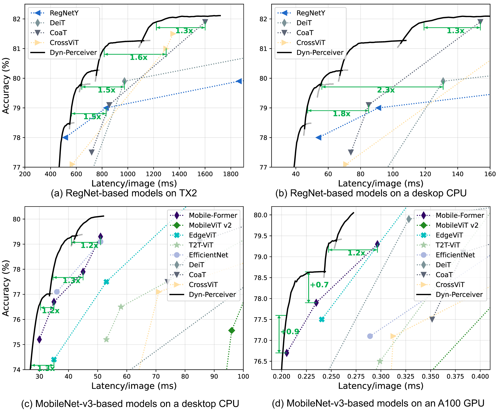

# Dynamic Perceiver for Efficient Visual Recognition


## Introduction

This repository contains the implementation of the ICCV 2023 paper, [*Dynamic Perceiver for Efficient Visual Recognition*](https://arxiv.org/abs/2306.11248). The proposed **Dynamic Perceiver (Dyn-Perceiver)** decouples the feature extraction procedure and the early classification task with a novel two-branch architecture, which significantly improves model performance in the dynamic early exiting scenario. 

### Overall idea




### Model overview




### The inference procedure



## Usage

### Dependencies

- Python: 3.8
- Pytorch: 1.12.1
- Torchvision: 0.13.1

### Scripts

- Train a **RegNetY-based Dynamic Perceiver** model on ImageNet:

```bash
CUDA_VISIBLE_DEVICES=0,1,2,3,4,5,6,7 python -m torch.distributed.launch  --nproc_per_node=8 main_earlyExit.py \
        --model reg800m_perceiver_t128 --depth_factor 1 1 1 2 --spatial_reduction true --with_last_CA true --SA_widening_factor 4 --with_x2z true --with_dwc true --with_z2x true --with_isc true \
        --num_workers 4 \
        --model_ema true --model_ema_eval true --epochs 300 \
        --batch_size 128 --lr 1e-3 --loss_cnn_factor 1.0 --loss_att_factor 0.5 --loss_merge_factor 1.0 --update_freq 1 --use_amp false --with_kd true --T_kd 1.0 --alpha_kd 0.5 \
        --data_path YOUR_DATA_PATH \
        --output_dir YOUR_SAVE_PATH &\
```

- Train a **ResNet-based Dynamic Perceiver** model on ImageNet:

```bash
CUDA_VISIBLE_DEVICES=0,1,2,3,4,5,6,7 python -m torch.distributed.launch  --nproc_per_node=8 main_earlyExit.py \
        --model resnet50_0375_perceiver_t128 --depth_factor 1 1 1 1 --spatial_reduction true --with_last_CA true --SA_widening_factor 4 --with_x2z true --with_dwc true --with_z2x true --with_isc true \
        --num_workers 4 \
        --model_ema true --model_ema_eval true --epochs 300 \
        --batch_size 128 --lr 6e-4 --loss_cnn_factor 1.0 --loss_att_factor 0.5 --loss_merge_factor 1.0 --update_freq 1 --use_amp false --with_kd true --T_kd 1.0 --alpha_kd 0.5 \
        --data_path YOUR_DATA_PATH \
        --output_dir YOUR_SAVE_PATH &\
```

- Train a **MobileNet-based Dynamic Perceiver** model on ImageNet:

```bash
CUDA_VISIBLE_DEVICES=0,1,2,3,4,5,6,7 python -m torch.distributed.launch  --nproc_per_node=8 main_earlyExit.py \
        --model mobilenetV3_0x75_perceiver_t128 --depth_factor 1 1 1 3 --spatial_reduction true --with_last_CA true --SA_widening_factor 4 --with_x2z true --with_dwc true --with_z2x true --with_isc true \
        --num_workers 4 \
        --model_ema true --model_ema_eval true --epochs 600 \
        --batch_size 128 --lr 1e-3 --loss_cnn_factor 1.0 --loss_att_factor 0.5 --loss_merge_factor 1.0 --update_freq 1 --use_amp false --with_kd true --T_kd 1.0 --alpha_kd 0.5 \
        --data_path YOUR_DATA_PATH \
        --output_dir YOUR_SAVE_PATH &\
```

- Evaluate (dynamic):

```bash
CUDA_VISIBLE_DEVICES=0 python main_earlyExit.py --eval true \
		--resume YOUR_CHECKPOINT_PATH \
        --model reg800m_perceiver_t128 --depth_factor 1 1 1 2 --spatial_reduction true --with_last_CA true --SA_widening_factor 4 --with_x2z true --with_dwc true --with_z2x true --with_isc true \
        --num_workers 4 \
        --batch_size 128 --lr 1e-3 --loss_cnn_factor 1.0 --loss_att_factor 0.5 --loss_merge_factor 1.0 --update_freq 1 --use_amp false --with_kd true --T_kd 1.0 --alpha_kd 0.5 \
        --data_path YOUR_DATA_PATH \
        --output_dir YOUR_SAVE_PATH &\
```


### Results

- : ImageNet results of Dyn-Perceiver built on top of MobileNet-v3.



- Speed test results of Dyn-Perceiver.



### Pre-trained Models on ImageNet
|model|acc_exit1|acc_exit2|acc_exit3|acc_exit4|Checkpoint Link|
|:-:|:-:|:-:|:-:|:-:|:-:|
|   reg800m_perceiver_t128   |  68.62  |  78.32  |   79.15   |  79.86  |[Tsinghua Cloud](https://cloud.tsinghua.edu.cn/f/ca3c8a808d504fdfa2c8/?dl=1) |
|   resnet50_0375_perceiver_t128   | 72.93 |   77.52   | 74.32 | 77.70 |[Tsinghua Cloud](https://cloud.tsinghua.edu.cn/f/844ac164a62246eb9ce8/?dl=1) |
|   mobilenetV3_0x75_perceiver_t128   |  53.13  |  71.65  |  71.89  |   74.59   |[Tsinghua Cloud](https://cloud.tsinghua.edu.cn/f/a86c56e3076146ad8748/?dl=1) |

### Contact

If you have any questions, please feel free to contact the authors. 

Yizeng Han: [hanyz18@mails.tsinghua.edu.cn](mailto:hanyz18@mails.tsinghua.edu.cn), [yizeng38@gmail.com](mailto:yizeng38@gmail.com).

Dongchen Han: [hdc19@mails.tsinghua.edu.cn](mailto:hdc19@mails.tsinghua.edu.cn), [tianqing1.10000@gmail.com](mailto:tianqing1.10000@gmail.com)


<!-- ## Ackowledgements

To be written. -->
